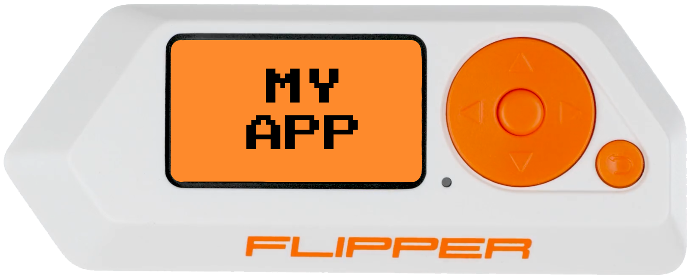

<div align="center">
  
  <h2 align="center">Flipper Zero - Development Toolkit</h2>
  <p align="center">
    Hey there, fellow developer!
  </p>
  <p align="center">
    Welcome to the repository that houses a comprehensive and user-friendly guide for crafting your very own Flipper Zero application. By simply following along with this curated readme, and customizing it to your preferences along the way, you'll have your app up and published in no time. No need to reinvent the wheel, I've got your back!
  </p>
  <p align="center">
    Let's build something awesome together! 💪💻
  </p>
  <a href="https://shop.flipperzero.one/">
    
  </a>
  <a href="https://docs.flipperzero.one/">
    
  </a>
</div>

---

## Table of Contents <a name="index"></a>

- [Previews](#previews)
- [Hardware Requirements](#hardware-requirements)
- [Hardware Installation](#hardware-installation)
- [Firmware Installation](#firmware-installation)
- [Software Installation](#software-installation)
- [Software Guide](#software-guide)
- [Development Guide](#development-guide)
- [Flipper Application Catalog](#flipper-application-catalog)
- [Contributions](#contributions)
- [Special Thanks To](#special-thanks-to)

## Previews <a name="previews"></a>

Add in-app screenshot previews in this section or GIF's to demonstrate your application in action. You can use [ScreenToGif][link-screen-to-gif] to record GIF's of your application.

<!--


-->

<p align="right">[ <a href="#index">Back to top</a> ]</p>

## Hardware Requirements <a name="hardware-requirements"></a>

Define hardware requirements to run your application here. For example, if your application requires a Flipper Zero GPIO device, you would add a link to the Flipper Zero GPIO device here.

<p align="right">[ <a href="#index">Back to top</a> ]</p>

## Hardware Installation <a name="hardware-installation"></a>

Add hardware installation instructions here. Useful for when you need to demonstrate GPIO device pinout guides and the like.

<p align="right">[ <a href="#index">Back to top</a> ]</p>

## Firmware Installation <a name="firmware-installation"></a>

Add firmware installation instructions here. As an example this would be useful for when you need a guide for flashing a custom firmware to your Flipper Zero GPIO device. Add firmware files to the "src-firmware/" directory.

<p align="right">[ <a href="#index">Back to top</a> ]</p>

## Software Installation <a name="software-installation"></a>

Add software installation instructions here.

This repository includes GitHub Actions that lint and compile your application automatically. In the latest [GitHub Actions][link-github-action] for this repository you will find zip files containing the FAP application compatible with either the "dev" or "release" build of the latest Flipper Zero firmware. To manually install the application (for instance your application is not yet available in the [Flipper Application Catalog][link-flipper-application-catalog]) you can download those files and manually install them on your Flipper Zero device via USB.

<p align="right">[ <a href="#index">Back to top</a> ]</p>

## Software Guide <a name="software-guide"></a>

Demonstrate how the application works regarding the Flipper Zero's button layout. You can use this to guide your users on how to use your application more clearly.

🔼 = Up button does **\_\_**.

🔽 = Down button does **\_\_**.

◀️ = Left button does **\_\_**.

▶️ = Right button does **\_\_**.

⚪ = Center button does **\_\_**.

↩️ = Go back does **\_\_**.

<p align="right">[ <a href="#index">Back to top</a> ]</p>

## Development Guide <a name="development-guide"></a>

1. Make sure you have [Git][link-git] and [Visual Studio Code][link-visual-studio-code] installed on your system.
2. Clone the repository and its submodule dependencies using the following command:
   ```bash
   git clone https://github.com/CodyTolene/Flipper-Zero-Development-Toolkit.git --recurse-submodules
   ```
3. Download and install [Python][link-python].
4. Open a new terminal in the "src-fap" directory of this project.
5. Run `py -m pip install --upgrade ufbt` to ensure you have the latest [uFBT][link-ufbt] installed.
6. Run `ufbt vscode_dist` to download the Windows toolchain and set up Visual Studio Code files.
7. Open the project "fap" directory ("src-fap") in Visual Studio Code. Make sure you have "Microsoft C/C++" extension installed and enabled.
8. In Visual Studio Code, open the command palette (CTRL+SHIFT+P) and type "C/C++ Edit Configurations (UI)" to find and open its settings. Add the following directory to the "Include path" option:
   ```
   ${workspaceFolder}/../.submodules/**
   ```
   This includes the Flipper Zero firmware library for your project (you can update it to a custom firmware if needed).
9. If Visual Studio Code shows import errors after saving the above settings from step 8, run the build script (see step 10) to resolve them.
10. It should now be possible perform various tasks within Visual Studio Code using Ctrl+Shift+B or "Terminal -> Run Task." Alternatively, you can use [uFBT][link-ufbt] scripts in the terminal. Here are some useful commands to get started:
    | Command | Description |
    | ------------- | -------------------------------------------------- |
    | `ufbt cli` | Starts a CLI session with the Flipper Zero device. |
    | `ufbt build` | Build the application. |
    | `ufbt lint` | Lint the application. |
    | `ufbt format` | Format the application. |
    | `ufbt launch` | Upload and start application over USB. |
11. You're now ready to begin programming your application within the directory "src-fap/" with "src-fap/toolkit.c" -> `toolkit_app(...)` being your entry point.
12. After making changes, linting, testing, etc., please refer to the [contributions section](#contributions) for a guide on how to submit your code for review (to make changes to this repo) or forking for your own use.

<p align="right">[ <a href="#index">Back to top</a> ]</p>

## Flipper Application Catalog <a name="flipper-application-catalog"></a>

Use the following flow to verify build requirements for the [Flipper Application Catalog][link-flipper-application-catalog]:

1. Open a new terminal at the root of this project.
2. Run `py -m venv venv` to install a [virtual environment][link-python-venv] for use.
3. Activate the virtual environment with the command `venv\Scripts\activate`.
4. Install the required dependencies by running `pip install -r .submodules/flipper-application-catalog/tools/requirements.txt`.
5. Ensure that "src-fap\manifest.yml" has the latest commit sha that will be used for submission. Also, verify that the version is correct.
6. Run `py .submodules/flipper-application-catalog/tools/bundle.py src-fap/manifest.yml bundle.zip` to verify and bundle the application.
7. If the above command succeeds, the application is ready for submission. Otherwise, fix any errors and try again.
8. Use `deactivate` to exit the virtual environment and return to your normal terminal.

For more information on Flipper Application Catalog contribution requirements, see [here][link-flipper-application-catalog-contribution].

<p align="right">[ <a href="#index">Back to top</a> ]</p>

## Contributions <a name="contributions"></a>

To create your own variation:

1. Fork the repository.
2. Add your code, push.

To add feedback to this repository:

1. Fork the repository.
2. Create a new branch with a descriptive name: `<username>/[<issue-#>]-<feature-or-bug-fix-desc>`
3. Refer to the Development Guide to get started. Program, commit changes, and push to your branch.
4. Publish a pull request [here][link-pull-request] for review from your branch.
5. Wait for review and merge. Thank you for your contribution!

<p align="right">[ <a href="#index">Back to top</a> ]</p>

## Special Thanks To <a name="special-thanks-to"></a>

- [Flipper Devices][link-flipper-devices] for providing the [Flipper Application Catalog][link-flipper-application-catalog], [uFBT][link-ufbt], their [firmware][link-flipper-zero-firmware], and the incredible [Flipper Zero][link-flipper-zero] hardware itself.
- Derek Jamison for his insightful [YouTube videos][link-derek-jamison-youtube] on Flipper Zero application development.
- GitHub user [leedave][link-leedave] for helping me learn more about Flipper Zero development by [boilerplate example][link-flipper-zero-boilerplate].
- The [Unleashed Firmware][link-unleashed] community and their valuable contributions.
- The [Xtreme Firmware][link-xtreme-firmware] community and their remarkable work.
- [Cody Tolene][link-cody-tolene] for creating the [Flipper Zero Development Toolkit][link-repo-flipper-zero-development-toolkit].
  Feel free to remove my name, but I would be thrilled to see and be a part of your work if you found this toolkit useful in any way! 😊 Happy coding! 💻

<p align="right">[ <a href="#index">Back to top</a> ]</p>

<!-- LINKS -->

[link-cody-tolene]: https://github.com/CodyTolene
[link-derek-jamison-youtube]: https://www.youtube.com/@MrDerekJamison
[link-flipper-application-catalog-contribution]: https://github.com/flipperdevices/flipper-application-catalog/blob/main/documentation/Contributing.md
[link-flipper-application-catalog]: https://github.com/flipperdevices/flipper-application-catalog
[link-flipper-devices]: https://github.com/flipperdevices/
[link-flipper-zero-boilerplate]: https://github.com/leedave/flipper-zero-fap-boilerplate
[link-flipper-zero-firmware]: https://github.com/flipperdevices/flipperzero-firmware
[link-flipper-zero]: https://docs.flipperzero.one/
[link-git]: https://git-scm.com/downloads
[link-github-action]: https://github.com/CodyTolene/Flipper-Zero-Development-Toolkit/actions
[link-leedave]: https://github.com/leedave
[link-pull-request]: https://github.com/CodyTolene/Flipper-Zero-Development-Toolkit/pulls
[link-python-venv]: https://docs.python.org/3/library/venv.html
[link-python]: https://www.python.org/downloads/
[link-repo-flipper-zero-development-toolkit]: https://github.com/CodyTolene/Flipper-Zero-Development-Toolkit
[link-screen-to-gif]: https://www.screentogif.com/
[link-ufbt]: https://github.com/flipperdevices/flipperzero-ufbt
[link-unleashed]: https://github.com/DarkFlippers/unleashed-firmware
[link-visual-studio-code]: https://code.visualstudio.com/download
[link-xtreme-firmware]: https://github.com/Flipper-XFW/Xtreme-Firmware
